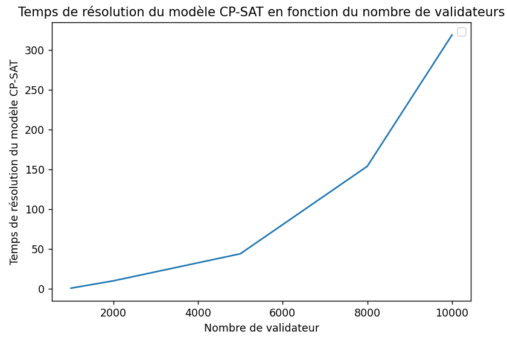

# Rapport final — Affectation de validateurs PoS en comites (CP-SAT)

Date: 17 mai 2026

## Resume

Ce projet modélise l’affectation de validateurs Proof-of-Stake à des comités comme un problème de Bin Packing avec contraintes d’équité, de taille et d’anti-affinité, résolu par CP-SAT. Deux baselines sont étudiées: un random shuffle (inspiré d’Ethereum) et une formulation PLNE (MILP). Les résultats confirmés indiquent que CP-SAT produit de meilleures solutions, mais au prix d’un temps de calcul beaucoup plus élevé dès 10 000 validateurs.

## Contexte et objectifs

Dans Ethereum (PoS), les validateurs doivent être répartis en comités:

- Taille minimale et maximale pour chaque comité.
- Équilibre de charge entre validateurs.
- Séparation d’opérateurs (anti-affinité) afin de réduire les risques de centralisation.

Objectifs:

- Implémenter un modèle CP-SAT complet.
- Ajouter deux baselines: random shuffle et PLNE (MILP).
- Évaluer la qualité et la performance sur des données réalistes.

## Les 3 différents modèles

### 1) CP-SAT (modele principal)

Le modèle CP-SAT optimise une combinaison pondérée des métriques suivantes:

- Imbalance: max(load) - min(load)
- Anti-affinité: pénalisation des regroupements d’un même opérateur
- Écart à la taille cible
- (Optionnel) churn temporel si plusieurs pas de temps

### 2) Random shuffle (baseline)

Affectation aléatoire des validateurs aux comités en respectant les bornes de taille. Cette approche est rapide, robuste et proche du comportement réel d’Ethereum, mais elle ne garantit pas d’optimisation des métriques de qualité.

### 3) PLNE / MILP (baseline)

Même formulation que CP-SAT, mais résolue via un solveur linéaire entier (CBC). Elle sert de comparaison sur la robustesse et la performance algorithmique.

### Source et distribution d’operateurs

Pour nos simulation nous utiliseront la distributions des plus gros opérateurs suivante:

| Opérateur   | Proportion |
| :---------- | :--------- |
| Lido        | 24%        |
| Coinbase    | 9%         |
| Binance     | 9%         |
| Rocket Pool | 9%         |
| Kraken      | 6%         |
| Blackrock   | 4%         |

Le reste des validateurs sera assigné à des opérateurs distincts (petits acteurs).

### Test de répartition sur une time frame

- Nombre de validateurs: 10 000
- Nombre de comités: min(ceil(10000/256), 64) = 40
- Taille minimale d’un comité: 128
- Taille cible: 10000/40 = 250
- Taille maximale: très large (max_size très élevé)
- Nombre de time frame: 1

## Resultats observes

Sur 10 000 validateurs:

- CP-SAT: environ 8 a 12 minutes pour obtenir une solution.
- MILP: environ 12 a 15 minutes pour obtenir une solution.
- Random shuffle: très rapide (quelques secondes a moins d'une minute).

Pour CP-SAT et MILP, le pourcentage maximal de validateur appartenant à un même opérateur au sein d'un comité ne dépasse jamais 24% ce qui est le pourcentage d'Ethereum staké opéré par le plus gros opérateur (Lido).

Tandis que pour le random shuffle, le pourcentage maximal de validateur appartenant à un même opérateur au sein d'un comité dépasse parfois 33% ce qui commence à être problématique. Cela dit, plus le nombre de validateur est élévé et plus ce pourcentage diminue. Avec 1 millions de validateurs ce qui correspond approximativement à la réalité, ce pourcentage ne dépasse jamais 27% ce qui est raisonnable.

Sur la qualite globale, CP-SAT et MILP fournissent des repartitions plus regulieres que le random shuffle. Les tailles de comites sont plus proches de la cible et la dispersion des charges est plus faible. Le random shuffle respecte bien les bornes de taille, mais montre davantage de variabilite locale (quelques comites plus charges que d'autres) et une anti-affinite moins controlee.

En termes de stabilite numerique, les solutions CP-SAT et MILP sont plus deterministes: a donnees identiques, les metriques restent proches d'un lancement a l'autre. Le random shuffle, lui, varie d'une execution a l'autre, ce qui est normal mais implique un besoin potentiel de repetition si l'on veut estimer une qualite moyenne.

Observons le temps de résolution du modèle CP-SAT en fonction du nombre de validateurs.

On voit que le temps de résolution semble augmenter de manière quadratique donc pour 1M de validateurs il faudrait approximativement 10 000 fois plus de temps que pour 10 000 validateurs, soit de l'ordre de plusieurs dizaines de jours.

Ces observations confirment donc que CP-SAT et MILP donne des solutions de meilleure qualité mais ne passe pas à l’échelle pour des tailles proches d’Ethereum (≈ 1M validateurs).

### Test de répartition sur plusieurs time frame plus petites

- Nombre de validateurs: 1 000
- Nombre de comités: min(ceil(1000/256), 64) = 4
- Taille minimale d’un comité: 128
- Taille cible: 1000/4 = 250
- Taille maximale: très large (max_size très élevé)
- Nombre de time frame: 10

## Resultats observes

Sur 1 000 validateurs et 10 time frames:

- CP-SAT: resolution en quelques dizaines de minutes.
- MILP: resolution plus lente que CP-SAT.
- Random shuffle: très rapide (quelques secondes a moins d'une minute).

La penalisation de churn permet de conserver une affectation relativement stable d'une time frame a l'autre, sans degrader significativement l'equilibre des tailles de comites.

On observe aussi que la contrainte de churn aide a lisser les changements: les validateurs ne basculent pas tous simultanement d'un comite a l'autre, ce qui est important pour eviter des fluctuations brusques. CP-SAT tire benefice de cette penalisation, tandis que le random shuffle n'a pas de mecanisme equivalent et peut generer des reconfigurations completes d'une periode a l'autre.

Enfin, sur ces instances plus petites, les differences entre CP-SAT et MILP sont surtout visibles dans le temps de calcul: la qualite reste globalement comparable, mais la resolution MILP reste plus lente.

## Analyse et interpretation

1. La qualité des solutions CP-SAT est supérieure, surtout sur l’anti-affinité et l’équilibre de charge.
2. Le coût de résolution est le principal obstacle pour une adoption à grande échelle.
3. Comme on pouvait s’y attendre, plus le nombre de validateurs est elevé, moins l’utilisation du random shuffle pose de probleme en termes de concentration par operateur.
4. Le random shuffle reste la solution la plus réaliste pour la production (Ethereum) grâce à sa scalabilité et sa simplicité.

## Limites

- Données réelles d’opérateurs incomplètes (labels externes).
- Absence d’expérimentation exhaustive à grande échelle.
- Métriques de décentralisation avancées (HHI, Gini) non calculées.

## Pistes futures

- Étendre le modèle temporel (entrées/sorties, churn) avec données historiques.
- Intégrer des métriques de robustesse plus riches (pannes multi-opérateurs).
- Comparer avec un modèle PLNE plus performant (Gurobi/CPLEX).

## Conclusion

Le CP-SAT est une approche solide et de haute qualité pour l’affectation des validateurs en comités, mais il ne passe pas à l’échelle pour des tailles proches d’Ethereum aujourd’hui. Le random shuffle, bien que plus simple, reste la stratégie la plus réaliste pour des raisons de performance. De plus avec le nombre de validateurs présent sur la blockchain Ethereum à l'heure actuelle, la probabilité qu'un random shuffle donne trop de pouvoir à un opérateur dans un comité est très faible.
