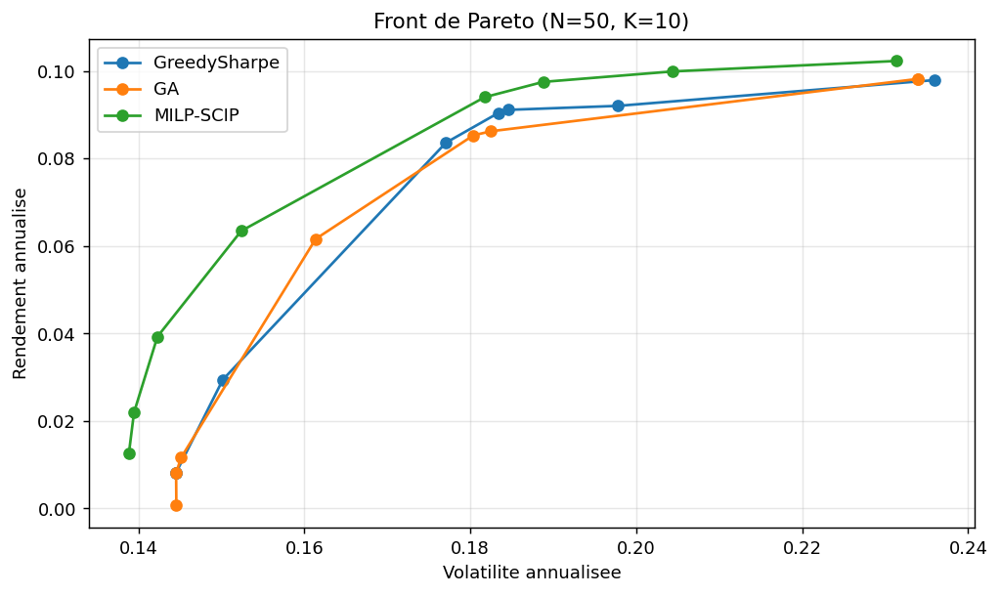
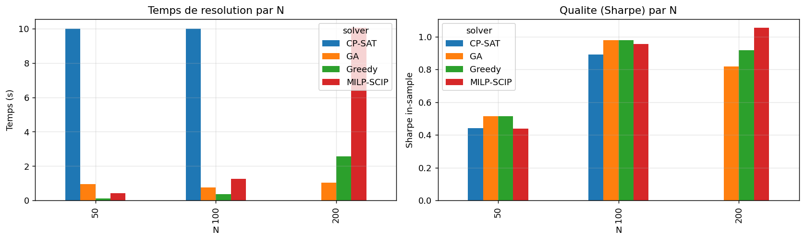
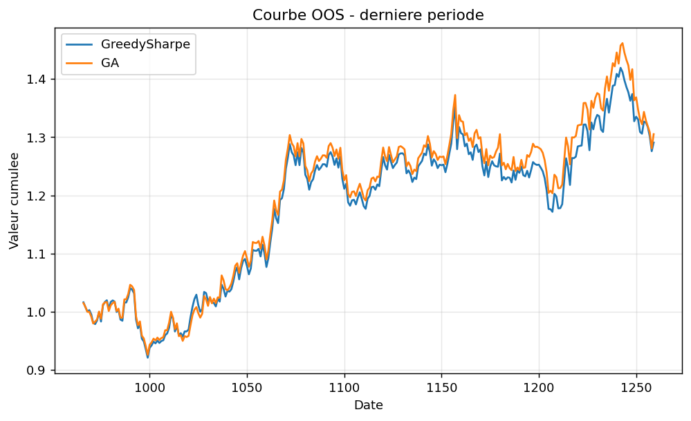

# Sparse Markowitz

Portefeuille mean-variance avec cardinalite exacte K parmi N.

EPITA SCIA M1 - PRCON 2026

---

# Contexte

- Markowitz 1952 : compromis rendement / variance.
- Solutions denses dans `R^N` : ingerables operationnellement.
- Extension sparse : exactement `K << N` actifs actifs.
- MIQP non convexe, NP-difficile (Bertsimas-Shioda 2009).

---

# Formulation

```
min   lambda * w' Sigma w  -  mu' w
s.c.  sum_i w_i = 1
      sum_i z_i = K
      w_min * z_i <= w_i <= w_max * z_i
      z_i in {0, 1}
```

Extensions : `sector_cap`, `turnover_cap`, `integer_lots`, buy-in threshold.

---

# Quatre approches

| Approche    | Principe                                    | Echelle    |
|-------------|---------------------------------------------|------------|
| MILP (SCIP) | MIQP exact, contrainte quadratique aux.     | N <= 300   |
| CP-SAT      | Cholesky entier + AddMultiplicationEquality | N <= 100   |
| Greedy      | Top-K Sharpe + local search 1-opt           | N <= 1000  |
| GA (DEAP)   | Selection subset + QP ferme                 | N <= 1000  |

---

# CP-SAT - Point technique

- Poids en basis points : `W_i in [0, 10000]` (scale=1000).
- Cholesky : `Sigma = U^T U`, `U_int = round(U * 100)`.
- Pour chaque k : `y_k = sum_i U_int[k,i] * W_i` (lineaire).
- `y_sq_k = y_k^2` via `AddMultiplicationEquality`.
- Facteur d'echelle `g = precision^2 / 100 = 100` aligne risk et ret.

---

# Resultats N=50, K=10, lambda=5.0, seed=42

| Solveur     | Statut    | Rendement | Volatilite | Sharpe | Temps   |
|-------------|-----------|-----------|------------|--------|---------|
| MILP-SCIP   | optimal   | 0.0643    | 0.1529     | 0.420  | 0.15s   |
| CP-SAT      | feasible  | 0.0668    | 0.1550     | 0.431  | 30.01s  |
| Greedy      | heuristic | 0.0836    | 0.1771     | 0.472  | 0.15s   |
| GA          | heuristic | 0.0616    | 0.1614     | 0.382  | 0.78s   |

Source : `results/reference_n50_k10.csv`.

---

# Front de Pareto (N=50, K=10)



GreedySharpe et GA tracent un front coherent avec MILP-SCIP.

---

# Scalabilite



MILP rapide jusqu'a N=200, CP-SAT cale a son time-limit, heuristiques quasi
constantes.

---

# Contraintes realistes

Plafond sectoriel 0.25 + turnover 0.4 (cf. notebook section 6) :

- max_sector exposure : 0.383 -> 0.250 (respecte).
- turnover : 1.78 -> 0.80 (respecte).
- rendement : 0.0643 -> -0.0005 (cout des contraintes operationnelles).

---

# Backtest OOS (rolling, 3 periodes)

Rebalance mensuel, commissions 10 bps :

| Periode | Sharpe Greedy | Sharpe GA |
|---------|---------------|-----------|
| 1       | -0.02         | -0.06     |
| 2       | +0.51         | +0.50     |
| 3       | +1.08         | +1.06     |

Source : `results/backtest.csv`. La selection K domine le choix du solveur.

---

# Courbes cumulees - derniere periode



Greedy et GA suivent des trajectoires tres similaires apres commissions.

---

# Symmetry breaking - lex sur z

- Convention : `z[idx[i]] >= z[idx[i+1]]` apres tri stable sur `mu` desc.
- Combinee a `sum(z) = K`, force la selection top-K mu.
- Plus une baseline experimentale qu'un vrai symmetry breaking (les actifs
  synthetiques ne sont jamais equivalents).

---

# Limites connues

- CP-SAT : `AddMultiplicationEquality` cher au-dela de N=100.
- SCIP via pyscipopt : pas de support natif MIQP, contournement via
  contrainte quadratique auxiliaire.
- Donnees synthetiques : backtest valide le pipeline, pas la performance.

---

# References academiques

- Markowitz, H. (1952). *Portfolio Selection*. Journal of Finance 7(1).
- Bertsimas, D. & Shioda, R. (2009). *Algorithm for cardinality-constrained
  quadratic optimization*. Comput. Optim. Appl. 43(1).
- Bonami, P. et al. (2018). *On mathematical programming with indicator
  constraints*. Math. Program. 151(1).
- Google OR-Tools. *CP-SAT Solver Reference*.

---

# Conclusion

- MILP-SCIP : reference, optimum exact jusqu'a N=200.
- CP-SAT : formulation pedagogique native, lent au-dela de N=50.
- Heuristiques : quasi-optimales, scalent a N=1000.
- Backtest : selection K domine le choix de solveur en OOS.
- Code modulaire et reproductible (`make bench && make figures`).
