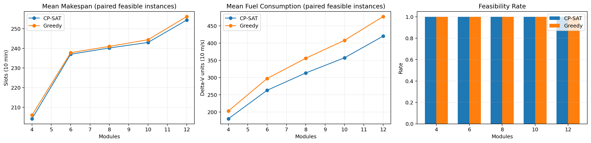
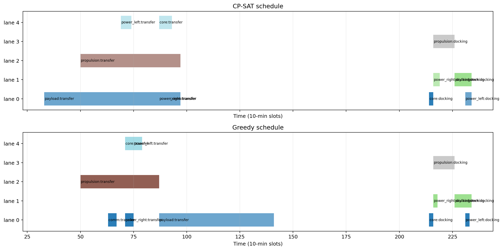

# Rapport final - C4 - Orbital Assembly Scheduling (CP-SAT)

Date: 21 mai 2026

## Resume

Ce projet modelise la planification de manoeuvres d'assemblage orbital comme un probleme de satisfaction et d'optimisation sous contraintes. Chaque module doit effectuer une manoeuvre de transfert puis une manoeuvre de docking, avec des fenetres temporelles, des contraintes de communication, des precedences, des separations de securite, un budget carburant total et une capacite delta-v concurrente.

Le solveur principal est un modele CP-SAT base sur `IntervalVar`, `NoOverlap` et `Cumulative`. Il est compare a une baseline gloutonne qui suit un ordre topologique priorisant les fenetres les plus contraintes.

## Contexte et objectifs

Dans un scenario d'assemblage orbital, plusieurs modules autonomes doivent rejoindre et s'arrimer a une structure centrale. La difficulte vient du fait que les decisions temporelles et energetiques sont couplees:

- une manoeuvre ne peut etre lancee que dans une fenetre de lancement et de communication compatible;
- deux manoeuvres utilisant le meme couloir orbital ne doivent pas se chevaucher;
- certaines manoeuvres imposent des precedences d'assemblage;
- des paires de docking doivent respecter une separation temporelle de securite;
- la somme des consommations delta-v doit rester sous budget;
- la consommation delta-v instantanee ne doit pas depasser une capacite concurrente.

L'objectif du projet est de produire un planning faisable, puis d'optimiser en priorite le makespan et ensuite la consommation de carburant.

## Formulation du probleme

### Donnees

On considere un ensemble de manoeuvres `M`. Pour chaque manoeuvre `i`, on connait:

- une fenetre admissible `[earliest_start_i, latest_end_i]`;
- deux profils possibles, `fast` et `eco`, avec une duree et une consommation delta-v;
- un couloir orbital `lane_i`;
- les precedences `pred -> succ`;
- les conflits de securite entre paires de manoeuvres;
- un horizon discret exprime en slots de 10 minutes.

Les donnees physiques synthetiques sont derivees de profils LEO/GEO simplifiees, avec transfert de Hohmann, periodes orbitales et enveloppes de visibilite station sol.

### Variables de decision

Pour chaque manoeuvre `i`, le modele cree:

- `start_i`: date de debut;
- `end_i`: date de fin;
- `duration_i`: duree choisie;
- `delta_v_i`: consommation choisie;
- `use_fast_i`: booleen indiquant le choix du profil rapide;
- `interval_i`: intervalle CP-SAT associe a la manoeuvre.

### Contraintes principales

1. Respect des fenetres temporelles:

`earliest_start_i <= start_i` et `end_i <= latest_end_i`.

2. Choix de profil:

`use_fast_i` impose les couples `(duration_fast, dv_fast)` ou `(duration_eco, dv_eco)`.

3. Exclusion par couloir orbital:

`NoOverlap(intervals_lane)` pour toutes les manoeuvres partageant le meme couloir.

4. Precedences:

`end_pred + lag <= start_succ`.

5. Separations de securite:

Pour chaque paire conflictuelle `(i, j)`, le modele impose soit `i` avant `j`, soit `j` avant `i`, avec une separation minimale.

6. Budget carburant:

`sum(delta_v_i) <= total_fuel_budget`.

7. Capacite delta-v concurrente:

`Cumulative(interval_i, delta_v_i, concurrent_dv_capacity)`.

### Fonction objectif

Le modele minimise une approximation lexicographique:

```text
objective = makespan * (total_fuel_budget + 1) + total_fuel
```

Cette ponderation force d'abord la minimisation du makespan, puis departage les solutions par la consommation totale de carburant.

## Baseline gloutonne

La baseline construit un ordre topologique des manoeuvres, puis choisit les taches disponibles dont la fenetre est la plus urgente. Pour chaque manoeuvre, elle tente de placer le profil rapide au plus tot, puis le profil eco si necessaire.

Chaque candidat est verifie contre:

- les fenetres temporelles;
- les precedences;
- les conflits de securite;
- les chevauchements de couloir;
- la capacite delta-v concurrente;
- le budget carburant restant.

Cette baseline fournit une comparaison simple et reproductible face au modele CP-SAT.

## Protocole experimental

Les experiences utilisent des instances synthetiques de 4, 6, 8, 10 et 12 modules. Chaque module genere deux manoeuvres, donc les instances contiennent de 8 a 24 manoeuvres. Pour chaque taille, cinq seeds sont testees: `11`, `22`, `33`, `44`, `55`.

Parametres principaux:

- horizon de base: 420 slots;
- limite CP-SAT: 20 secondes;
- workers CP-SAT: 8;
- duree d'un slot: 10 minutes;
- unite delta-v: 10 m/s.

Les resultats sont stockes dans:

- `results/benchmark_raw.csv`;
- `results/benchmark_summary.csv`.

## Resultats observes

| Modules | Instances | Faisabilite CP-SAT | Faisabilite glouton | Makespan CP-SAT | Makespan glouton | Fuel CP-SAT | Fuel glouton | Gain fuel moyen |
| :-- | --: | --: | --: | --: | --: | --: | --: | --: |
| 4 | 5 | 100% | 100% | 204.2 | 206.0 | 180.4 | 203.0 | 11.26% |
| 6 | 5 | 100% | 100% | 237.0 | 237.8 | 263.0 | 297.2 | 11.30% |
| 8 | 5 | 100% | 100% | 240.2 | 241.0 | 313.4 | 356.2 | 12.04% |
| 10 | 5 | 100% | 100% | 243.0 | 244.4 | 357.4 | 408.2 | 12.43% |
| 12 | 5 | 100% | 100% | 254.4 | 256.2 | 420.4 | 477.4 | 11.85% |

Les deux approches trouvent une solution valide sur toutes les instances testees. CP-SAT garde un makespan legerement meilleur et reduit surtout la consommation de carburant d'environ 11 a 12% par rapport au glouton.



La comparaison visuelle sur une instance unique permet aussi de verifier que les couloirs orbitaux, les fenetres et les precedences sont respectes.



## Analyse

CP-SAT est plus adapte a ce probleme car les contraintes structurantes du sujet correspondent directement aux primitives du solveur:

- `IntervalVar` represente naturellement les manoeuvres;
- `NoOverlap` exprime les couloirs orbitaux exclusifs;
- `Cumulative` encode la capacite delta-v instantanee;
- les precedences et separations se formulent comme contraintes lineaires ou disjonctives.

La baseline gloutonne est robuste et simple, mais elle prend des decisions locales. Elle preserve la faisabilite sur ces instances, mais consomme plus de carburant car elle privilegie souvent les profils rapides pour placer les manoeuvres au plus tot.

Sur les petites instances du benchmark, CP-SAT est tres rapide et trouve des solutions optimales. Cela ne garantit pas un passage a l'echelle lineaire: le nombre de choix temporels, de conflits et de combinaisons de profils augmente rapidement avec le nombre de modules.

## Limites

- La physique orbitale est volontairement simplifiee: orbites circulaires, transferts de Hohmann et enveloppes de communication approximatives.
- Les fenetres de communication ne modelisent pas une propagation orbitale haute fidelite.
- Le benchmark reste synthetique et limite a 12 modules.
- Le modele optimise seulement le makespan et le carburant; il ne traite pas encore la robustesse aux retards ou aux pertes de liaison.

## Pistes d'amelioration

- Ajouter des incertitudes sur les dates de manoeuvre et les fenetres de communication.
- Tester des instances plus grandes et plus denses en conflits de securite.
- Ajouter une optimisation multi-objectif plus fine: makespan, carburant, marge temporelle et robustesse.
- Comparer CP-SAT a une formulation MILP ou a une heuristique hybride CP-SAT + recherche locale.

## Conclusion

Le modele CP-SAT fournit une formulation claire et efficace pour le sujet C4. Il respecte les contraintes principales d'un assemblage orbital discretise et produit des solutions de meilleure qualite que la baseline gloutonne sur le benchmark fourni. Le rendu contient le code reproductible, les resultats CSV, les figures principales et le rapport final.
